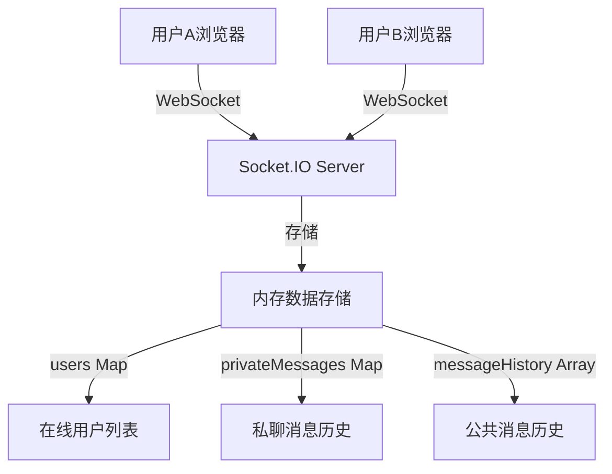
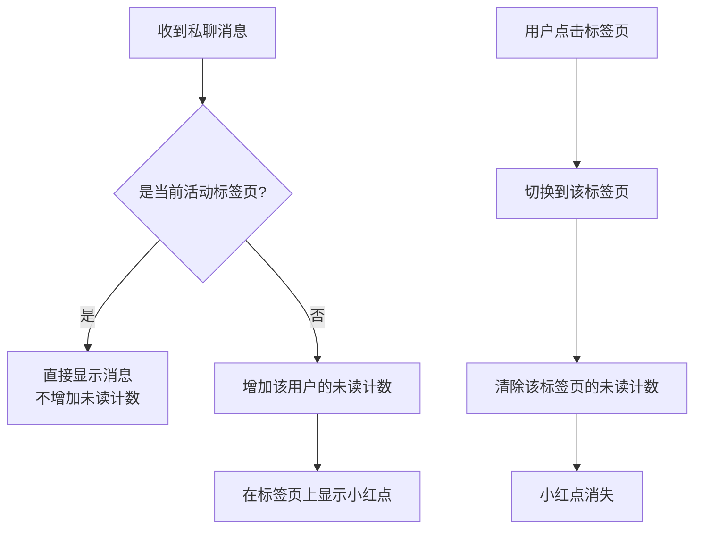
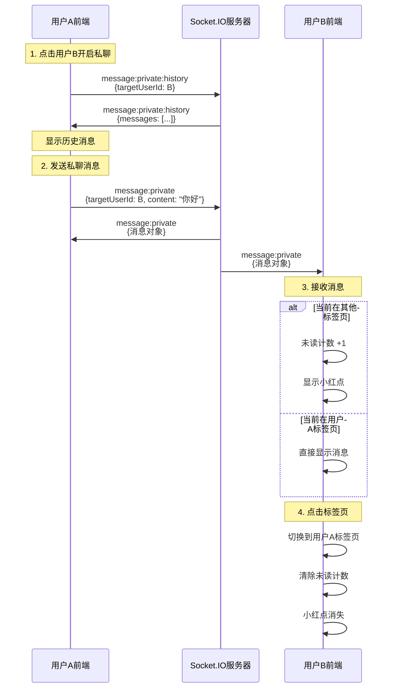

# 私聊功能与未读消息提示实现文档

## 目录
- [功能概述](#功能概述)
- [技术架构](#技术架构)
- [后端实现](#后端实现)
- [前端实现](#前端实现)
- [小红点提示机制](#小红点提示机制)
- [数据流程](#数据流程)
- [关键代码解析](#关键代码解析)

---

## 功能概述

本聊天应用实现了以下核心功能：

1. **私聊功能**：用户可以点击在线用户列表中的其他用户，开启一对一私聊
2. **标签页管理**：支持多个私聊标签页，可以在公共聊天室和多个私聊窗口之间切换
3. **未读消息提示**：使用小红点（Badge）显示未读消息数量
4. **消息历史**：保存并可查询私聊历史记录

---

## 技术架构

### 技术栈
- **后端**: Node.js + Express + Socket.IO
- **前端**: React + Ant Design + Socket.IO Client
- **实时通信**: WebSocket (通过 Socket.IO 实现)

### 架构图



---

## 后端实现

### 1. 数据结构设计

后端使用以下数据结构存储信息：

```javascript
// 在线用户映射: socketId -> 用户信息
const users = new Map(); 
// 结构: { id, username, socketId, joinTime }

// 私聊消息历史: conversationId -> 消息数组
const privateMessages = new Map(); 
// conversationId 格式: "userId1_userId2" (按字母序排序)

// 公共消息历史
const messageHistory = [];
```

#### 会话ID生成算法

```javascript
const getConversationId = (userId1, userId2) => {
  return [userId1, userId2].sort().join('_');
};
```

> [!IMPORTANT]
> 会话ID通过对两个用户ID排序后拼接生成，确保无论谁发起对话，两个用户之间的会话ID都是唯一且一致的。

### 2. Socket.IO 事件处理

#### 发送私聊消息事件

**事件名称**: `message:private`

**触发时机**: 用户在前端发送私聊消息时

**处理流程**:

```javascript
socket.on('message:private', ({ targetUserId, content }) => {
  // 1. 验证发送者和接收者
  const sender = users.get(socket.id);
  const receiver = users.get(targetUserId);
  
  // 2. 构建私聊消息对象
  const privateMessage = {
    id: Date.now(),
    type: 'private',
    fromUserId: sender.id,
    fromUsername: sender.username,
    toUserId: receiver.id,
    toUsername: receiver.username,
    content: content,
    timestamp: new Date()
  };

  // 3. 保存到私聊历史
  const conversationId = getConversationId(sender.id, receiver.id);
  if (!privateMessages.has(conversationId)) {
    privateMessages.set(conversationId, []);
  }
  privateMessages.get(conversationId).push(privateMessage);

  // 4. 发送给双方
  socket.emit('message:private', privateMessage);           // 发送者
  socket.to(receiver.socketId).emit('message:private', privateMessage); // 接收者
});
```

#### 获取私聊历史事件

**事件名称**: `message:private:history`

**触发时机**: 用户打开私聊标签页时

**处理流程**:

```javascript
socket.on('message:private:history', ({ targetUserId }) => {
  const conversationId = getConversationId(socket.id, targetUserId);
  const history = privateMessages.get(conversationId) || [];
  socket.emit('message:private:history', { targetUserId, messages: history });
});
```

---

## 前端实现

### 1. 状态管理

前端使用 React Hooks 管理以下状态：

```javascript
// 当前活动标签页: 'public' 或 userId
const [activeTab, setActiveTab] = useState('public');

// 私聊标签页列表
const [privateChatTabs, setPrivateChatTabs] = useState([]);
// 结构: [{ userId, username }]

// 私聊消息存储
const [privateMessages, setPrivateMessages] = useState({});
// 结构: { userId: [messages] }

// 未读消息计数
const [unreadCounts, setUnreadCounts] = useState({});
// 结构: { userId: count }
```

### 2. 开启私聊流程

**触发方式**: 点击在线用户列表中的用户

```javascript
const handleStartPrivateChat = (user) => {
  // 1. 检查是否已有标签页
  const existingTab = privateChatTabs.find(tab => tab.userId === user.id);
  if (!existingTab) {
    // 2. 创建新标签页
    setPrivateChatTabs([...privateChatTabs, { 
      userId: user.id, 
      username: user.username 
    }]);
    // 3. 请求历史消息
    socket.emit('message:private:history', { targetUserId: user.id });
  }
  // 4. 切换到该标签页
  setActiveTab(user.id);
  // 5. 清除未读计数
  setUnreadCounts((prev) => {
    const newCounts = { ...prev };
    delete newCounts[user.id];
    return newCounts;
  });
};
```

### 3. 接收私聊消息

```javascript
socket.on('message:private', (msg) => {
  // 1. 确定对方用户ID
  const otherUserId = msg.fromUsername === username 
    ? msg.toUserId 
    : msg.fromUserId;
  const otherUsername = msg.fromUsername === username 
    ? msg.toUsername 
    : msg.fromUsername;
  
  // 2. 保存消息到对应用户的消息列表
  setPrivateMessages((prev) => ({
    ...prev,
    [otherUserId]: [...(prev[otherUserId] || []), msg]
  }));
  
  // 3. 自动创建标签页（如果不存在）
  setPrivateChatTabs((prev) => {
    if (!prev.find(tab => tab.userId === otherUserId)) {
      return [...prev, { userId: otherUserId, username: otherUsername }];
    }
    return prev;
  });
  
  // 4. 更新未读计数（如果不是当前活动标签页）
  setActiveTab((currentTab) => {
    if (currentTab !== otherUserId) {
      setUnreadCounts((prev) => ({
        ...prev,
        [otherUserId]: (prev[otherUserId] || 0) + 1
      }));
    }
    return currentTab;
  });
});
```

---

## 小红点提示机制

### 1. 核心原理

小红点提示基于以下逻辑实现：



### 2. 未读计数更新时机

#### 增加未读计数

**时机**: 收到私聊消息且该消息不属于当前活动标签页

```javascript
setActiveTab((currentTab) => {
  if (currentTab !== otherUserId) {
    setUnreadCounts((prev) => ({
      ...prev,
      [otherUserId]: (prev[otherUserId] || 0) + 1
    }));
  }
  return currentTab;
});
```

> [!TIP]
> 使用函数式更新 `setActiveTab((currentTab) => ...)` 确保获取到最新的 `activeTab` 值，避免闭包陷阱。

#### 清除未读计数

**时机**: 用户点击标签页切换到该对话

```javascript
onClick={() => {
  setActiveTab(tab.userId);
  setUnreadCounts((prev) => {
    const newCounts = { ...prev };
    delete newCounts[tab.userId];
    return newCounts;
  });
}}
```

### 3. UI 展示

使用 Ant Design 的 `Badge` 组件显示未读计数：

```jsx
<Badge count={unreadCounts[tab.userId] || 0} offset={[10, 0]}>
  👤 {tab.username}
</Badge>
```

**效果**:
- 当 `count > 0` 时，显示红色圆形徽章，内含未读数量
- 当 `count = 0` 时，徽章自动隐藏

---

## 数据流程

### 完整私聊流程图



---

## 关键代码解析

### 1. 标签页渲染

[ChatRoom.jsx:L222-L252](file:///d:/project/frontend/src/components/ChatRoom.jsx#L222-L252)

```jsx
<div className="chat-tabs">
  {/* 公共聊天室标签 */}
  <div 
    className={`chat-tab ${activeTab === 'public' ? 'active' : ''}`}
    onClick={() => setActiveTab('public')}
  >
    💬 公共聊天室
  </div>
  
  {/* 私聊标签页 */}
  {privateChatTabs.map(tab => (
    <div 
      key={tab.userId}
      className={`chat-tab ${activeTab === tab.userId ? 'active' : ''}`}
      onClick={() => {
        setActiveTab(tab.userId);
        // 清除未读计数
        setUnreadCounts((prev) => {
          const newCounts = { ...prev };
          delete newCounts[tab.userId];
          return newCounts;
        });
      }}
    >
      {/* 小红点徽章 */}
      <Badge count={unreadCounts[tab.userId] || 0} offset={[10, 0]}>
        👤 {tab.username}
      </Badge>
      {/* 关闭按钮 */}
      <CloseOutlined 
        className="tab-close-btn"
        onClick={(e) => handleClosePrivateChat(tab.userId, e)}
      />
    </div>
  ))}
</div>
```

### 2. 消息显示逻辑

[ChatRoom.jsx:L186-L193](file:///d:/project/frontend/src/components/ChatRoom.jsx#L186-L193)

```javascript
const getCurrentMessages = () => {
  if (activeTab === 'public') {
    return messages;  // 公共消息
  } else {
    return privateMessages[activeTab] || [];  // 私聊消息
  }
};
```

### 3. 发送消息逻辑

[ChatRoom.jsx:L109-L130](file:///d:/project/frontend/src/components/ChatRoom.jsx#L109-L130)

```javascript
const handleSendMessage = () => {
  if (!inputMessage.trim() || !isConnected) return;

  if (activeTab === 'public') {
    // 发送公共消息
    socket.emit('message:send', inputMessage.trim());
  } else {
    // 发送私聊消息
    socket.emit('message:private', {
      targetUserId: activeTab,
      content: inputMessage.trim()
    });
  }
  setInputMessage('');
};
```

---

## 技术亮点

### 1. 会话ID设计

通过对用户ID排序生成唯一会话ID，确保：
- 无论谁发起对话，会话ID都一致
- 避免重复存储相同对话的消息

### 2. 函数式状态更新

使用函数式更新避免闭包陷阱：

```javascript
setActiveTab((currentTab) => {
  // 使用最新的 currentTab 值
  if (currentTab !== otherUserId) {
    setUnreadCounts((prev) => ({
      ...prev,
      [otherUserId]: (prev[otherUserId] || 0) + 1
    }));
  }
  return currentTab;
});
```

### 3. 自动标签页创建

当收到新用户的私聊消息时，自动创建标签页，提升用户体验：

```javascript
setPrivateChatTabs((prev) => {
  if (!prev.find(tab => tab.userId === otherUserId)) {
    return [...prev, { userId: otherUserId, username: otherUsername }];
  }
  return prev;
});
```

### 4. 事件冒泡控制

关闭标签页时阻止事件冒泡，避免触发标签页切换：

```javascript
const handleClosePrivateChat = (userId, e) => {
  e.stopPropagation();  // 关键：阻止冒泡
  // ... 关闭逻辑
};
```

---

## 扩展建议

### 1. 持久化存储

当前消息存储在内存中，服务器重启后会丢失。建议：
- 使用 Redis 存储在线用户和消息
- 使用 MongoDB/PostgreSQL 持久化历史消息

### 2. 消息已读状态

可以添加消息已读/未读状态：
- 后端记录每条消息的已读状态
- 前端显示"已读"/"未读"标识

### 3. 消息推送优化

- 添加消息推送音效
- 浏览器通知 API (Notification API)
- 离线消息推送

### 4. 性能优化

- 消息虚拟滚动（处理大量历史消息）
- 消息分页加载
- WebSocket 心跳检测

---

## 总结

本文档详细介绍了聊天应用中私聊功能和小红点提示的实现原理：

1. **后端**: 使用 Socket.IO 处理私聊消息事件，通过会话ID管理消息历史
2. **前端**: 使用 React 状态管理标签页、消息和未读计数
3. **小红点**: 基于当前活动标签页判断是否增加未读计数，切换标签页时清除

整个实现充分利用了 WebSocket 的实时通信能力和 React 的响应式状态管理，提供了流畅的用户体验。
